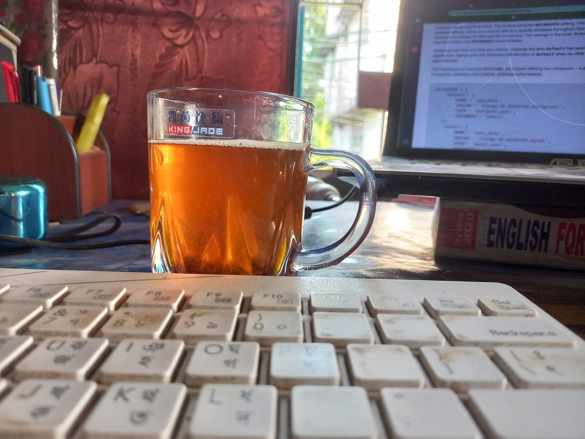

## 👋 :nerd_face: Hello
 <br/>

```python
class ShomiKhan:
    def __init__(self):
        self.role = "Software Engineer"
        self.interests = [
            "Low-Level Systems 🛠️", "Cloud-Native Development 🌐", "Machine Learning 🤖"
        ]
        self.skills = {
            "languages": ["Python", "Go", "Javascript", "C++", "Bash"],
            "backend": ["Django", "DRF", "FastAPI", "Gin", "RabbitMQ", "Redis", "PostgreSQL", "REST", "gRPC"],
            "frontend": ["React", "Nextjs", "Angular", "HTML", "TailwindCSS"],
            "cloud_&_devops": ["Docker", "Nginx", "Linux", "AWS"],
            "tools": ["VSCode", "Pycharm", "Postman"]
        }
        self.hobbies = [
            "Riding Bicycle 🚴", "Binging on Anime ⛩️", "Photography 📸"
        ]

    def greet(self):
        print('''
            Hello,
            I love to chat 🗨️ rather than talk.
            If you ping me with a `hi`, I'll be happy to chat with you more! 😊
        ''')


if __name__ == "__main__":
    me = ShomiKhan()
    me.greet()


```

<!-- ## Github Stats  
<div align="left"></div> -->

<!-- ### 📬 Let’s Connect
Reach me through: [](https://linkedin.com/in/shomi-khan-64b418118) [](https://facebook.com/shomi.khan1) -->
<br/>

<!-- ### 🕹️ My Toolbox 🧩
                   -->

<div style="display: flex; justify-content: center; align-items: center;">
<!--  -->
<! --  
</div>
